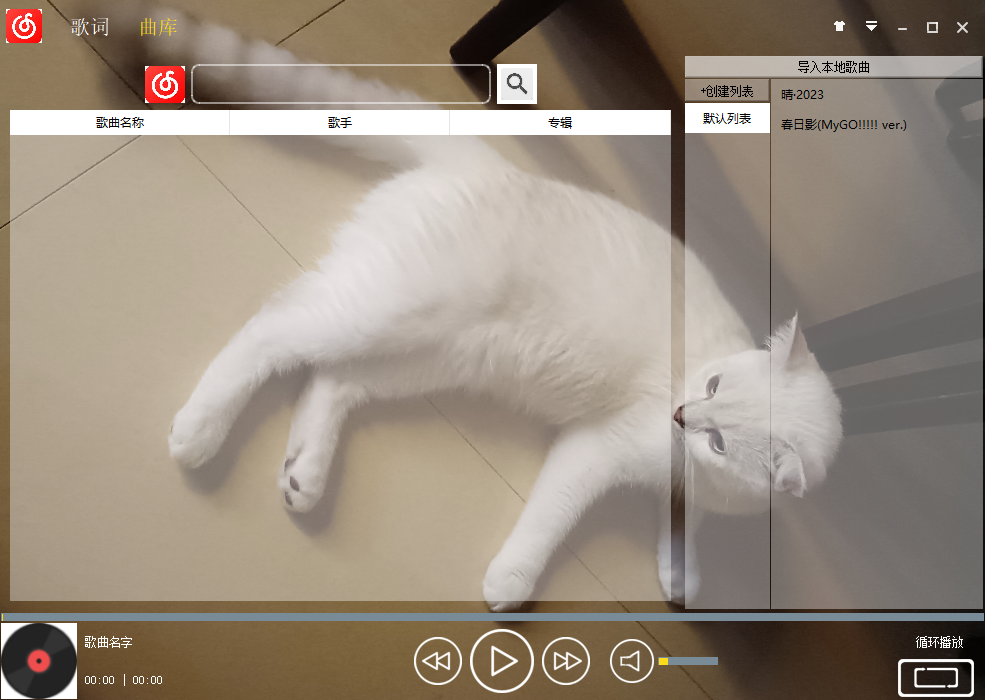
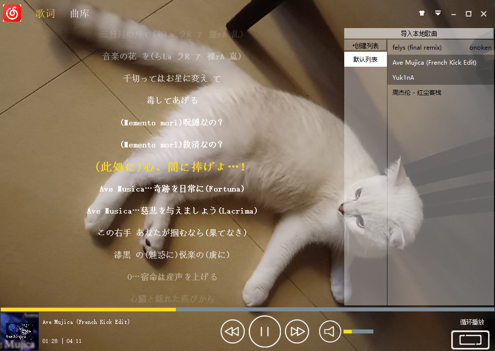
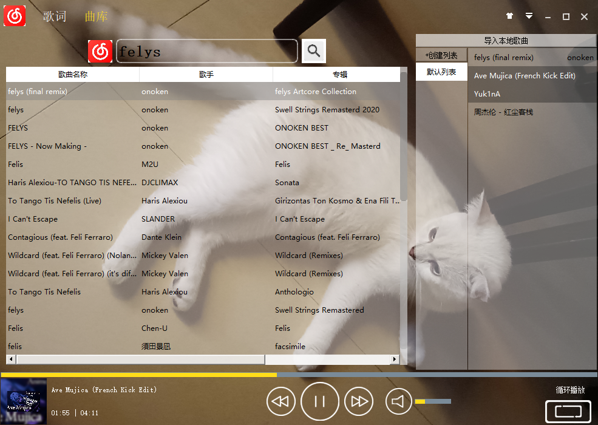

# QtMusic
This is a music player written by C++ GUI Qt

# 编译方式
Qt Creator 4.4.1
Based on Qt 5.9.3 (MSVC 2015, 32 bit)
Build by Destop Qt 5.9.3 MinGW 32bit
使用SQLite

# 备注
在十天左右完成一个接近应用的音乐播放器，完全靠自己难度很大，更何况是第一次使用qt。
在制作过程中，我阅读了一些开源音乐项目的源码，例如酷我音乐，千千静听，还有github上面的一些开源项目，也参考了他们的架构和UI设计。
qt提供的开发者平台也帮助了我解决了许多开发中遇到的问题。
使用了github上的一个开源项目 网易云音乐 Node.js API service (https://docs.neteasecloudmusicapi.binaryify.com/#/)   
来帮助我实现网络音乐的在线播放，我也将其部署到了自己的服务器上，方便老师直接进行测试。

# 界面效果图

## 软件架构

1. **核心模块**：
   - **数据处理（Data）**：处理配置信息，用户歌单，音乐文件信息的存储与提取。
   - **歌词处理（Lyric）**：负责歌词的加载和显示。
   - **音乐信息（MusicInfo）**：管理音乐文件的元数据，如艺术家、专辑等。
   - **播放器核心（MyPlayer）**：处理播放控制逻辑，如播放、暂停、停止。
   - **播放模式（PlayMode）**：定义了播放模式的枚举类型，如单曲循环、顺序播放等。

2. **用户界面（UI）**：
   - **主窗口（MusicWindow）**：整合顶部栏、底部栏、歌词显示等。
   - **工具组件（ToolWidget）**：包括各类按钮、菜单、滑块等，用于构建复杂的用户界面。
   - **系统托盘（MySystemTrayIcon）**：管理系统托盘图标的显示和交互。

3. **网络处理模块（NetworkWidget）**：
   - **网络部件（NetworkPage, SearchList）**：处理网络相关内容和搜索结果展示。

4. **附加功能**：
   - **皮肤切换（SkinMenu）**：允许用户更改应用皮肤。
   - **音量控制（VoiceSlider）**：用户可以调整音量。

### 应用层

#### MusicWindow
- **功能**：整合播放器的主要功能。
- **引用**：
  - `TopBar`
  - `QStackedWidget`（包含 `LyricLabel`, `NetworkPage`）
  - `MusicPage`
  - `BottomBar`
  - `MyPlayer`
  - `QNetworkAccessManager`

### 交互层

#### BottomBar
- **功能**：提供音乐播放控制。
- **引用**：
  - `SliderWidget`（音乐进度控制）
  - `VoiceSlider`（音量控制）

#### MusicPage
- **功能**：管理播放列表。
- **引用**：
  - `ListList`（播放列表）
  - `QStackedWidget`（包含多个 `MusicList`）

#### NetworkPage
- **功能**：网络音乐搜索和下载。
- **引用**：
  - `QNetworkAccessManager`（网络请求）

### 逻辑层

#### MyPlayer
- **功能**：音乐播放和状态管理。
- **引用**：内部媒体播放相关的类和库。

#### Data
- **功能**：数据管理和存储。
- **引用**：SQLite数据库。

### 工具组件层

- **SliderWidget** 和 **VoiceSlider**
  - **功能**：提供滑动条控件。
- **FuctionLabel**
  - **功能**：提供功能标签。
- **IconButton**
  - **功能**：提供图标按钮。
- **MyMenu**
  - **功能**：提供自定义菜单。
- **SkinMenu**
  - **功能**：提供皮肤选择菜单。
  - **引用**：`IconButton`
- **mysystemtrayicon**
  - **功能**：提供系统托盘访问。
- **mainwindow**
  - **功能**：提供应用窗口大小的调节支持。
  

### 基础服务层

#### MusicApplication
- **功能**：管理应用程序生命周期。
- **引用**：
  - `QSharedMemory`（单实例检测）

### 架构总览

- **顶层（应用层）**：`MusicWindow` 作为应用的主窗口，集成所有功能模块。
- **交互层**：`BottomBar`, `MusicPage`, `NetworkPage`，处理用户界面的交互和功能调用。
- **逻辑层**：`MyPlayer` 和 `Data`，负责音乐播放和数据处理。
- **工具组件层**：提供UI层所需的各种自定义工具，如 `SliderWidget`, `VoiceSlider`, `FuctionLabel`, `IconButton`, `MyMenu`, `SkinMenu`。
- **底层（基础服务层）**：`MusicApplication` 提供应用程序整体生命周期的管理。

# 功能说明

- **音乐播放**
  - 通过 `MyPlayer` 类实现，支持多种格式（如 MP3、WAV、FLAC 等）。
  - 用户可以播放、暂停、前进和后退音乐。
  - 通过底部控制栏 `BottomBar` 与用户进行交互，提供播放控制按钮。

- **歌词显示**
  - 通过 `LyricLabel` 类在 `MusicWindow` 的功能页面上实现歌词同步显示。
  - 歌词可以随音乐滚动，并且用户可以通过拖拉音乐进度条来跳转播放进度。
  - 实现了网络搜索歌词和显示本地歌词文件的功能。

- **播放列表管理**
  - 通过 `MusicPage` 类与子组件 `ListList` 和 `MusicList` 管理播放列表。
  - 用户可以创建新的列表、添加音乐、删除单曲或整个列表。
  - 用户对播放列表的操作通过 `QStackedWidget` 在主界面显示。

- **音乐搜索**
  - 通过 `NetworkPage` 类实现网络音乐搜索。
  - 用户可以输入关键词进行在线音乐搜索，并将搜索结果添加到播放列表。
  - 网络搜索功能通过 `QNetworkAccessManager` 实现与外部音乐服务的通信。

- **皮肤自定义**
  - 通过 `SkinMenu` 类允许用户选择不同的皮肤来个性化界面。
  - 提供了一系列预设的皮肤选项，并允许用户添加自定义皮肤。
  - 皮肤更改通过 `MusicWindow` 类设置背景，并保存在程序数据中以持久化用户的选择。

- **音量调节**
  - 通过 `BottomBar` 中的 `VoiceSlider` 类实现音量调节功能。
  - 用户可以通过拖动滑块来调整音量，并可视化音量级别。
  - 音量调节同样与 `MyPlayer` 类交互，确保音量变化能实时反映在音乐播放上。

- **系统托盘功能**
  - 通过 `MySystemTrayIcon` 类实现最小化到系统托盘的功能。
  - 用户可以从系统托盘恢复程序，或直接退出程序。
  - 托盘图标提供快速访问常用功能，如播放模式切换和主窗口显示。

- **播放模式选择**
  - 用户可以选择不同的播放模式，如单曲播放、循环播放、顺序播放等。
  - 播放模式的选择通过 `BottomBar` 中的播放模式菜单进行，并由 `MyPlayer` 类处理。

- **音乐信息展示**
  - 音乐的详细信息（如艺术家、专辑封面等）在播放时展示。
  - 通过 `MusicInfo` 类存储音乐的元数据，并在界面中展示。

- **网络连接管理**
  - 通过 `QNetworkAccessManager` 类管理应用的网络请求，包括歌词和封面图片的下载。
  - 错误处理机制来应对网络请求失败的情况，例如封面图的重试下载。

- **用户界面个性化**
  - 除了皮肤更换，还可以通过 `IconButton` 和 `FuctionLabel` 提供更多的用户界面个性化选项。
  - 用户可以自定义其他界面元素，如歌词界面更改字体和显示颜色。

- **单实例运行**
  - 通过 `QSharedMemory` 确保应用程序只有一个实例在运行。
  - `MusicApplication` 类管理应用程序实例，并防止多个实例启动。

- **最小化到任务栏**
  - 用户可以将应用程序最小化到任务栏而不是完全关闭，方便在后台播放音乐。

- **自动更新播放列表**
  - 当新歌曲添加到播放列表或歌曲被移除时，播放列表会自动更新。
  - `ListList` 和 `MusicList` 组件保持同步，确保用户界面反映最新的播放列表状态。

- **设置保存和读取**
  - 应用程序能够保存用户设置，如音量、播放模式和皮肤选择，并在重启后恢复。
  - `Data` 类负责持久化存储和读取这些设置。

- **错误处理和日志记录**
  - 在各个模块中，通过适当的异常处理和日志记录来确保程序的健壮性。
  - 例如，在网络请求失败或文件读写异常时进行错误处理和用户通知。

#### TODO List（时间有限，还未完成）
- **下载管理**
  - 在代码中目前被设置为不可见，`DownloadLabel` 预计提供下载管理功能。
  - 用户将能够将歌曲下载到本地（已实现,在搜索页面右键歌曲即可下载，说明还未添加到开发文档），并且管理和查看下载进度。

- **快捷键支持**
  - 允许用户通过键盘快捷操作播放控制。

- **用户登录和歌单查询**
  - 允许用户通过网易云账号密码登录，同时获取和上传自己的歌单。

- **歌词窗口显示**
  - 允许用户开关歌词浮动窗口。

- **音乐品质选择**
  - 允许用户选择音乐品质。

# 详细开发说明文档

## Data 类功能和实现

#### 数据库连接和初始化
- **connectData()**
  - 初始化和打开数据库连接。
  - 检查数据目录，如果不存在则创建。
  - 连接 SQLite 数据库 `musicData.db`。

- **tryConnectListList()**
  - 确保 `listlist` 表存在，如果不存在则创建。
  - 创建的表结构包括 `name`（列表名称）、`id`（列表ID）、`count`（列表中的歌曲数量）。

- **tryConnectMusicList()**
  - 确保 `musiclist` 表存在，如果不存在则创建。
  - 创建的表结构包括 `listname`（列表名称）、`id`（歌曲ID）、`dir`（文件路径）、`name`（歌曲名称）、`artist`（艺术家）。

- **tryConnectBaseInfo()**
  - 确保 `baseinfo` 表存在，如果不存在则创建。
  - 创建的表结构包括 `name`（配置名称）和 `val`（配置值）。

#### 播放列表管理
- **getListList()**
  - 获取数据库中 `listlist` 表的所有播放列表名称。
  - 如果没有播放列表，则创建一个默认列表。

- **addList(QString name)**
  - 向数据库中添加新的播放列表。
  - 检查播放列表是否已存在，防止重复添加。

- **deleteList(QString name)**
  - 删除指定名称的播放列表。
  - 更新相关的 `musiclist` 表，删除关联的歌曲记录。

- **getListId(QString name)**
  - 获取特定播放列表的ID。

#### 音乐列表管理
- **getMusicName()**, **getMusicDir()**，**getMusicArtist()**
  - 根据列表名称和歌曲ID获取歌曲名称，路径和艺术家名称。

- **getMusicList(QString listName)**
  - 获取特定播放列表中的所有音乐信息。

- **setArtist()**
  - 设置特定音乐的艺术家名称。

- **addMusicsToEnd()**, **deleteMusic()**, **deleteAllMusic()**, **moveMusic()**
  - 添加、删除和移动播放列表中的歌曲。

#### 应用设置管理
- **getListCount()**, **changeListCount()**, **getCurrentBackground()**, **changeCurrentBackground()**, **getSoundLevel()**, **changeSoundLevel()**, **getPlayMode()**, **changePlayMode()**
  - 读取和修改 `baseinfo` 表中的应用设置，如播放列表数量、当前背景、声音级别、播放模式。

#### TODO
- **数据库事务管理**：在 `addMusicsToEnd()` 和 `moveMusic()` 中使用事务处理，以确保数据的一致性和完整性。
- **字符串处理**：在处理查询参数时，替换掉特殊字符（如单引号），防止 SQL 注入攻击。

#### 总结
`Data` 类负责所有与数据库相关的操作，包括播放列表的管理、音乐信息的存取和应用设置的处理。

## Lyric 类功能和实现

#### 构造函数
- **Lyric()**
  - 默认构造函数。

#### 歌词文件处理
- **getFromFile(QString dir)**
  - 从指定目录的文件中读取和解析歌词。
  - 使用自定义的方式解析时间标签和歌词文本。
  - 支持 LRC 歌词格式，处理歌词的时间标签 `[mm:ss.xxx]` 和歌词文本。
  - 歌词和时间信息存储在 `position` 和 `line` 向量中。
  - 处理多个时间标签对应同一行歌词的情况。

#### 时间标签和歌词检索
- **getIndex(qint64 pos)**
  - 通过二分查找在 `position` 中找到最接近的时间标签索引。
  - 参数 `pos` 是音乐的当前播放时间（毫秒）。
  - 返回与 `pos` 最接近的歌词行索引。

- **getPostion(int index)**
  - 根据给定的索引返回对应的时间标签（毫秒）。
  - 如果索引超出范围，返回 0。

- **getLineAt(int index)**
  - 返回指定索引处的歌词行。

- **getCount()**
  - 返回歌词行数。

#### 歌词字符串解析
- **parseFromString(const QString &lyricData)**
  - 直接从字符串中解析歌词和时间标签。
  - 使用正则表达式匹配 `[mm:ss.xxx]` 格式的时间标签和对应的歌词文本。
  - 解析结果同样存储在 `position` 和 `line` 向量中。

#### 总结
`Lyric` 类是一个专门用于处理 LRC 歌词文件的类，能够解析时间标签和对应的歌词文本，并提供基于时间的歌词检索功能。

## MusicInfo 类功能和实现

#### 构造函数
- **MusicInfo()**
  - 默认构造函数。

#### 成员变量
- **id**
  - 表示音乐文件的唯一标识符。
- **dir**
  - 存储音乐文件的路径。
- **name**
  - 歌曲的名称。
- **artist**
  - 歌曲的演唱者。
- **coverUrl**
  - 歌曲或专辑的封面图片URL。

#### 成员函数
- **setId(int idVal)**
  - 设置音乐文件的ID。
- **setDir(QString dirStr)**
  - 设置音乐文件的路径。
- **setName(QString nameStr)**
  - 设置歌曲名称。
- **setArtist(QString artistStr)**
  - 设置歌曲的演唱者。
- **setCoverUrl(QString url)**
  - 设置封面图片的URL。

- **getDir()**
  - 返回音乐文件的路径。
- **getName()**
  - 返回歌曲名称。
- **getArtist()**
  - 返回歌曲的演唱者。
- **getCoverUrl()**
  - 返回封面图片的URL。
- **getId()**
  - 返回音乐文件的ID。

#### 细节说明
- **数据封装**：类的设计遵循良好的面向对象原则，封装了与音乐文件相关的信息，提供了清晰的接口用于设置和获取这些信息。
- **灵活性和扩展性**：该类可以轻松地扩展以包含更多与音乐文件相关的信息，例如添加新的成员变量和相应的设置/获取方法。

#### 总结
`MusicInfo` 类承担管理音乐文件信息的责任，为存储和访问音乐文件的信息提供结构化的方式。通过这种方式，可以方便地处理不同的音乐文件，并在需要时访问它们的详细信息。

## MyPlayer 类功能和实现

#### 构造函数
- **MyPlayer()**
  - 初始化播放器状态为 `NOMUSIC`。
  - 设置多个 `QMediaPlayer` 信号与本类槽函数的连接。

#### 成员函数
- **播放控制**
  - **setPlay()** 和 **play()**：开始播放音乐。
  - **setPause()** 和 **pause()**：暂停播放音乐。
  - **playNext()**：根据播放模式决定下一曲的播放逻辑。
  - **playTheMusic(QString, int)**：播放指定列表和索引的音乐。
  - **playPre()** 和 **playNext()**：播放上一曲或下一曲。

- **播放列表管理**
  - **addMusics(QString, QQueue<MusicInfo>)**：将音乐信息队列添加到指定播放列表。
  - **removeTheMusic()** 和 **removeAllMusics()**：从播放列表中移除一首或所有歌曲。
  - **moveMusic()**：在播放列表中移动歌曲位置。
  - **addMedia()** 和 **clear()**：添加一首歌曲到播放列表或清空播放列表。

- **播放器状态和信息获取**
  - **setCurrentIndex()** 和 **getCurrentIndex()**：设置或获取当前播放歌曲的索引。
  - **getPlayerState()**：获取播放器的当前状态。
  - **mediaCount()**：返回当前播放列表中的歌曲数量。
  - **getArtist()**：获取当前播放歌曲的艺术家信息。
  - **getCurrentPosition()**：获取当前播放位置（毫秒）。

- **播放器设置**
  - **setVoice(int)**：设置播放器音量。
  - **setPlayMode(int)**：设置播放模式。
  - **setPosition(qint64)**：设置播放位置（毫秒）。

#### 槽函数
- **musicChanged()**：当歌曲改变时触发的槽函数。
- **stateChanged(int)**：当播放器状态改变时触发的槽函数。

#### 信号
- **durationChanged(qint64)**：当播放的歌曲时长改变时发出的信号。
- **musicChanged(QString, int)**：当播放的音乐改变时发出的信号。
- **positionChanged(qint64)**：当播放位置改变时发出的信号。
- **musicNotAvailable()**：当播放的音乐不可用时发出的信号。
- **playerStateChanged(int)**：当播放器状态改变时发出的信号。

#### 总结
`MyPlayer` 类提供了音乐播放的基本功能，包括播放控制、播放列表管理和播放模式设置。

## PlayMode 枚举类型

#### 枚举值
- **CurrentItemOnce**
  - 播放当前项目一次，播放完后停止。
- **CurrentItemInLoop**
  - 循环播放当前项目。
- **Sequential**
  - 顺序播放列表中的项目，到达列表末尾后停止。
- **Loop**
  - 循环播放整个列表。
- **Random**
  - 随机播放列表中的项目。

#### 集成与播放器逻辑
这些播放模式被集成到播放器的核心逻辑，例如在 `MyPlayer` 类中。通过设置播放模式，可以根据当前模式决定何时停止播放、重复当前歌曲或选择列表中的下一首歌。

###3 总结
`PlayMode` 为音乐播放器提供了播放控制方式，允许用户根据个人喜好选择不同的播放模式。

## LabelButton 类功能和实现

#### 构造函数
- **LabelButton(QWidget *parent = 0)**
  - 构造函数创建了一个 `LabelButton` 实例。
  - 设置固定大小为 40x40。

#### 成员函数
- **setIcon(QString dir)**
  - 设置按钮的图标。
  - 使用传入的图标路径 `dir` 加载 `QPixmap`，并根据 `LabelButton` 的尺寸进行缩放。

#### 事件处理
- **enterEvent(QEvent *e)**
  - 鼠标进入事件处理。
  - 将鼠标光标设置为手型，表示这是一个可点击的元素。

- **leaveEvent(QEvent *e)**
  - 鼠标离开事件处理。
  - 将鼠标光标设置回箭头。

- **mousePressEvent(QMouseEvent *e)**
  - 鼠标按下事件处理。
  - 只在左键点击时发出 `clicked()` 信号，其他按钮点击忽略。

#### 信号
- **clicked()**
  - 当 `LabelButton` 被点击时发出的信号。

#### 总结
`LabelButton` 类是一个自定义控件，结合了 `QLabel` 的显示功能和按钮的交互功能。

## NetworkPage 类功能和实现

#### 构造函数
- **NetworkPage(QWidget *parent = 0)**
  - 创建一个网络页面，初始化网络访问管理器和UI元素（如搜索按钮、输入框）。
  - 连接网络管理器的 `finished` 信号到对应的槽函数，用于处理网络请求的完成。

#### 成员函数
- **searchSongs()**
  - 对歌曲的搜索操作。构造网络请求并发送。
- **searchFinished(QNetworkReply *reply)**
  - 处理搜索结果。从网络响应中解析歌曲数据并更新UI。
- **addSongsToCurrentList(QVector<int> &songs)**
  - 将选中的歌曲添加到当前播放列表。
- **tryAddSongToCurrentList(int which, int id)**
  - 从网络上获取特定歌曲的信息，如URL，然后添加到播放列表。

- **fetchLyrics(int songId)**
  - 获取指定歌曲的歌词。
- **lyricsFetched(QNetworkReply* reply)**
  - 处理获取到的歌词数据。

#### 事件处理
- **enterEvent(QEvent *e)**
  - 鼠标进入事件处理。当鼠标进入 `NetworkPage` 时触发。

#### 信号
- **mouseEnter()**
  - 当鼠标进入页面时发出的信号。
- **tryAddSongToCurrentList(MusicInfo musicInfo)**
  - 请求将一首歌曲添加到播放列表的信号。
- **lyricsAvailable(const QString &lyrics)**
  - 当歌词可用时发出的信号。

#### 总结
`NetworkPage` 类是负责网络交互的重要部分，它处理网络搜索、获取歌词等功能。

## SearchList 类功能和实现

#### 构造函数
- **SearchList(QWidget *parent = 0)**
  - 创建一个表格控件，配置样式、表头和行为。
  - 设置表格的列数和表头标题。
  - 配置自定义的右键菜单。

#### 成员函数
- **addSong(const QString &, const QString &, const QString &, const QString &)**
  - 向表格中添加一行歌曲信息，包括歌曲名称、艺术家、专辑名和封面URL。
- **clearSongs()**
  - 清空表格中的所有歌曲。

#### 事件处理
- **resizeEvent(QResizeEvent *event)**
  - 调整列宽以适应窗口大小的变化。
- **contextMenuEvent(QContextMenuEvent *event)**
  - 处理右键点击事件，显示自定义的上下文菜单。

#### 信号
- **rightClicked()**
  - 当用户右键点击表格时发出的信号。
- **addSongsToCurrentList(QVector<int> &songs)**
  - 请求将选中的歌曲添加到当前播放列表的信号。

#### 槽函数
- **addSongsToCurrentList()**
  - 将选中的歌曲添加到播放列表。

#### 关键部分
- **UI设计**：通过透明背景和自定义滚动条样式，提高了表格的视觉效果。
- **用户交互**：实现了右键菜单，提供了用户交互的便利性。

#### 总结
`SearchList` 类是一个基于 `QTableWidget` 的自定义控件，用于显示搜索到的歌曲列表，并提供与之相关的操作。

## BottomBar 类功能和实现

#### 构造函数
- **BottomBar(QWidget *parent = 0)**
  - 初始化底部控制栏，配置布局和样式。
  - 创建并配置各种子控件，包括进度条、封面按钮、播放控制按钮等。

#### 成员函数
- **播放控制与信息显示**
  - **setMusicTitle(QString name)**：设置当前播放音乐的标题。
  - **setCoverImage(const QPixmap &image)**：设置音乐封面图像。
  - **getCoverButton()**：返回封面按钮的指针。

- **音量和播放模式**
  - **getPlayMode()**, **setPlayMode(int mode)**：获取和设置播放模式。
  - **getSoundLevel()**, **setSoundLevel(int sound)**：获取和设置音量水平。

- **播放进度**
  - **setPostionAvailable()**, **setPostionNotAvailable()**：设置进度条是否可用。
  - **setMaxDuration(qint64 max)**：设置音乐的最大持续时间。
  - **changePostionTo(qint64 pos)**：更改播放进度。

- **播放控制**
  - **setPlay()**, **setPause()**：控制音乐播放和暂停。

#### 事件处理
- **dealMouse()**
  - 连接子标签的鼠标进入事件到 `mouseEnter` 信号。

#### 信号
- **mouseEnter()**, **showLyric(QString name)**, **setPostion(qint64 pos)** 等发出不同的用户交互信号。

#### 槽函数
- **clickCover()**, **postionChanged(qreal pos)**, **voiceChanged(qreal pos)** 等响应各种用户操作。

#### 总结
`BottomBar` 类是一个自定义控制栏，提供了音乐播放器的关键控制功能。

## IconButton 类功能和实现

#### 构造函数
- **IconButton(QWidget *parent = 0)**
  - 默认构造函数，初始化按钮的透明背景和状态标志。
- **IconButton(const QString &iconDir, QWidget *parent = 0)**
  - 重载的构造函数，初始化按钮并设置图标。

#### 成员函数
- **setTheIcon(const QString &iconDir)**
  - 设置按钮的图标（使用 `QString` 对象）。
- **setIcon(const QPixmap &icon)**
  - 设置按钮的图标（使用 `QPixmap` 对象）。
- **setIJ(int i, int j)**
  - 设置按钮的额外标识信息（用于区分按钮或处理复杂逻辑）。

#### 事件处理
- **paintEvent(QPaintEvent *e)**
  - 绘制按钮的图标，根据鼠标是否悬停来调整样式。
- **mousePressEvent(QMouseEvent *e)** 和 **mouseReleaseEvent(QMouseEvent *e)**
  - 处理鼠标点击事件，更新按钮状态并发出点击信号。
- **enterEvent(QEvent *e)** 和 **leaveEvent(QEvent *e)**
  - 处理鼠标进入和离开事件，更新按钮的视觉效果。

#### 信号
- **clicked()**
  - 当按钮被点击时发出的信号。
- **clicked(int i, int j)**
  - 当按钮被点击时发出的信号，附带额外的标识信息。

#### 关键点
- **视觉效果**：按钮在鼠标悬停时显示一个灰色的圆形背景。
- **灵活性**：通过提供设置图标的方法，允许在运行时改变按钮的图标。

#### 总结
`IconButton` 类是一个自定义按钮控件，用于所有需要图标表示的按钮。

## ImageButton 类功能和实现

#### 构造函数
- **ImageButton(QWidget *parent = 0)**
  - 基础构造函数，初始化一些基本属性。
- **ImageButton(const QString &icon, int num, QWidget *parent = 0)**
  - 重载构造函数，用于创建按钮并设置图像和图像切割数目。
- **ImageButton(const QString &icon, bool isDivision, int num, QWidget *parent = 0)**
  - 另一个重载构造函数，提供了一个选项来决定是否按部分切割图像或使用不同的图像表示按钮状态。

#### 成员函数
- **setOneButtonInfo(const QString &icon, int num = 4)**
  - 设置单个图像按钮信息。
- **setDivisionButtonInfo(const QString &icon, int num = 3)**
  - 设置分割图像按钮信息。
- **setCursorEnable(bool cursorEnable)**
  - 设置鼠标光标是否在进入按钮时改变形状。
- **setButtonStatus(ButtonStatus status)**
  - 根据按钮状态设置图像。

#### 事件处理
- **paintEvent(QPaintEvent *e)**
  - 绘制按钮图像。
- **mousePressEvent(QMouseEvent *e)** 和 **mouseReleaseEvent(QMouseEvent *e)**
  - 处理鼠标点击事件，更新按钮状态并发出点击信号。
- **enterEvent(QEvent *e)** 和 **leaveEvent(QEvent *e)**
  - 处理鼠标进入和离开事件，更新按钮的视觉效果。
- **changeEvent(QEvent *e)**
  - 处理控件状态变化事件。

#### 信号
- **clicked()**
  - 当按钮被点击时发出的信号。
- **mouseEnter()**
  - 当鼠标进入按钮时发出的信号。

#### 总结
`ImageButton` 类是一个图像按钮控件，提供了多种方法来设置按钮的视觉样式和交互行为。在我的软件中用于皮肤按钮，菜单按钮，最大、最小化按钮和关闭按钮图标加载的实现。

## ListList 类功能和实现

#### 构造函数
- **ListList(QWidget *parent = 0)**
  - 初始化一个表格控件，设置基本样式和行为。

#### 成员函数
- **setHighLight(int row)**
  - 高亮显示指定行。
- **removeHighLight(int row)**
  - 移除指定行的高亮显示。
- **getHighLightRow()**
  - 获取当前高亮显示的行。
- **getHighLightRowName()**
  - 获取当前高亮行的名称。
- **createList(QString name)**
  - 创建一个新的列表项，当用户输入新列表的名称并触发添加列表的操作时，此函数被调用。
- **wantToCreateList()**
  - 准备创建一个新的列表项，主要实现用户对列表项名称的编辑，进而创建新列表。

#### 事件处理
- **clickEvent()**
  - 处理列表项的点击事件。
- **enterEvent(QEvent *e)**
  - 处理鼠标进入事件。
- **contextMenuEvent(QContextMenuEvent *event)**
  - 处理右键点击事件，显示上下文菜单。

#### 信号
- **mouseEnter()**
  - 当鼠标进入控件时发出的信号。
- **rightClicked()**
  - 当在列表项上点击右键时发出的信号。
- **changeList(int index)**
  - 当选中的列表项发生改变时发出的信号。
- **tryToCreateList(QString name)**
  - 请求创建一个新列表项的信号。
- **deleteList(QString name)** 和 **deleteList(int index)**
  - 请求删除一个列表项的信号。

#### 槽函数
- **deleteList()**
  - 删除当前选中的列表项。

#### 总结
`ListList` 类是一个自定义列表控件，用于展示和管理有序列表。用户可以方便地与列表进行交互，例如添加、删除和选择列表项。这个类在我的软件中主要用于用户歌单的实现。

## LyricLabel 类主要功能和实现

#### 构造函数
- **LyricLabel(bool touch, QWidget *parent = 0)**
  - 初始化 `LyricLabel`，设置基本属性和字体、颜色等。

#### 成员函数
- **setLyrics(const QString &lyrics)**
  - 设置歌词文本，并通过 `Lyric` 类解析这些歌词。
- **setMyPlayer(MyPlayer *player)**
  - 设置与 `LyricLabel` 关联的 `MyPlayer` 对象，用于获取当前播放的歌曲进度。
- **paintItem(QPainter* painter, int index, const QRect &rect)**
  - 实现 `AbstractWheelWidget` 的抽象方法，用于绘制每一行歌词。
- **itemHeight()** 和 **itemCount()**
  - 实现 `AbstractWheelWidget` 的抽象方法，分别用于定义每个歌词项的高度和总歌词行数。
- **startLyricScroll(qint64 totalTime)** 和 **stopLyricScroll()**
  - 控制歌词滚动的开始和停止。

#### 事件处理
- **contextMenuEvent(QContextMenuEvent *event)** 和 **enterEvent(QEvent *e)**
  - 处理右键菜单和鼠标进入事件。
  
#### 槽函数
- **postionChanged(qint64 pos)** 和 **setPostion(qint64 pos)**
  - 根据歌曲播放进度更新歌词的显示位置。

#### 关键点
- **动态歌词显示**：`LyricLabel` 能够根据当前播放进度动态更新歌词的显示位置。
- **自定义外观**：通过设置字体、普通颜色和高亮颜色，可以自定义歌词的显示效果。
- **上下文菜单**：提供了右键菜单，允许用户进行额外的操作，如更改字体和颜色。

#### 总结
`LyricLabel` 类是一个基于 `AbstractWheelWidget` 的自定义歌词显示控件，用于在音乐播放应用中展示滚动的歌词。这个类的设计使它能够动态显示歌词，并根据播放进度更新歌词的显示位置。

## MainWindow 类主要功能和实现

#### 构造函数
- **MainWindow(QWidget *parent = 0)**
  - 初始化 `MainWindow`，设置窗口为无边框并定义最大最小尺寸。

#### 成员函数
- **setMaxSize()**
  - 控制窗口的最大化和恢复正常大小。
- **region(const QPoint &cursorGlobalPoint)**
  - 判断鼠标在窗口的哪个区域，用于调整窗口大小。

#### 事件处理
- **mouseReleaseEvent(QMouseEvent *event)**
  - 处理鼠标释放事件，主要用于停止窗口大小调整。
- **mousePressEvent(QMouseEvent *event)**
  - 处理鼠标按下事件，用于开始拖动或调整窗口大小。
- **mouseMoveEvent(QMouseEvent *event)**
  - 处理鼠标移动事件，用于更新窗口位置或大小。

#### 槽函数
- **loseMouse()**
  - 当鼠标焦点丢失时，重置鼠标形状和窗口调整方向。

#### 枚举
- **Direction**
  - 定义了窗口调整大小时的方向枚举，如 `UP`, `DOWN`, `LEFT`, `RIGHT` 等。

#### 宏定义
- **PADDING**
  - 定义了窗口边缘用于检测鼠标动作的宽度。

#### 总结
`MainWindow` 类是一个自定义的主窗口类，继承自 `QWidget`。这个类实现了无边框窗口的功能，并且支持通过鼠标拖动和调整窗口大小。它为创建桌面应用程序提供了一个自定义的窗口界面。

## MusicList 类主要功能和实现

#### 构造函数和析构函数
- **MusicList(QWidget *parent = 0)**
  - 初始化 `MusicList` 并设置样式和行为。
- **~MusicList()**
  - 析构函数中输出调试信息，表明 `MusicList` 被销毁。

#### 成员函数
- **setArtist(int index, QString artist)**
  - 设置指定索引处歌曲的艺术家信息。
- **setHighLight(int row)**
  - 高亮显示指定行。
- **removeHighLight()**
  - 移除高亮显示。

#### 槽函数
- **playTheMusic()**
  - 播放当前选中的音乐。
- **removeTheMusic()**
  - 移除当前选中的音乐。
- **removeAllMusic()**
  - 清空音乐列表。
- **doubleClickedEvent(QModelIndex index)**
  - 双击事件处理，用于播放选中的音乐。

#### 事件处理
- **enterEvent(QEvent *e)**
  - 鼠标进入事件处理。
- **contextMenuEvent(QContextMenuEvent *event)**
  - 上下文菜单事件处理。
- **dropEvent(QDropEvent *event)**
  - 处理拖放事件，用于重新排列音乐列表。

#### 关键点
- **自定义项 `MusicListItem`**：`MusicList` 使用了自定义的 `MusicListItem` 控件来显示每个音乐项目的信息，如歌曲名称和艺术家。
- **拖放功能**：支持通过拖放来重新排序音乐列表。
- **上下文菜单**：用户可以通过右键点击来打开一个包含播放、删除等操作的菜单。

#### 总结
`MusicList` 类是一个基于 `QListWidget` 的自定义列表控件，用于显示音乐列表。它提供了一系列用于管理和展示音乐项目的功能。

## MusicPage 类主要功能和实现

#### 构造函数
- **MusicPage(QWidget *parent = 0)**
  - 初始化 `MusicPage`，包括布局设置、信号与槽的连接等。

#### 成员函数
- **setCurrentList(int index)**
  - 设置当前选中的音乐列表。
- **getCurrentList()**
  - 获取当前选中的音乐列表名称。
- **addMusics(QStringList fileDir)**
  - 添加多个音乐文件到当前列表。
- **addMusics(int listId, QQueue<MusicInfo> musics)**
  - 将一个 `QQueue` 的 `MusicInfo` 对象添加到指定的音乐列表中。
- **addMusic(MusicInfo musicInfo)**
  - 添加单个 `MusicInfo` 对象到当前音乐列表。
- **clearMusic()**
  - 清除当前音乐列表的内容。
- **removeHighLight()**
  - 移除列表中的高亮显示。
- **setHighLight(int list, int index)**
  - 在指定列表和索引处设置高亮。
- **setArtist(int list, int index, QString artist)**
  - 设置指定列表和索引处歌曲的艺术家。

#### 槽函数
- **play(int index)**
  - 播放指定索引处的音乐。
- **createList()**
  - 创建一个新的音乐列表。
- **deleteList(int index)**
  - 删除指定索引的音乐列表。
- **removeTheMusic(int index)**
  - 从当前列表中移除指定索引处的音乐。
- **removeAllMusics()**
  - 清空当前音乐列表的所有歌曲。
- **moveMusic(int from, int to)**
  - 在当前列表中移动歌曲位置。

#### 事件处理
- **enterEvent(QEvent *e)**
  - 鼠标进入事件处理。

#### 关键点
- **使用 `QStackedWidget` 管理多个音乐列表**：`musicLists` 是一个 `QStackedWidget`，用于存放和切换不同的音乐列表视图。
- **使用 `QSplitter` 组织布局**：界面左侧是播放列表，右侧是对应列表的歌曲，使用 `QSplitter` 组织以允许用户调整两部分的大小。

#### 总结
`MusicPage` 类是一个 `QWidget` 的子类，主要用于在音乐播放器中管理和显示音乐列表。该类提供了一个界面，允许用户浏览、播放、导入本地歌曲以及创建和删除播放列表。

## 层次关系补充

#### `MusicPage` 类
- `MusicPage` 是一个容器类，作为音乐播放器的一个主要界面部分。它负责整合和管理音乐列表的显示和交互。
- 它使用 `QStackedWidget` (`musicLists`) 来管理多个 `MusicList` 实例，每个 `MusicList` 实例代表一个音乐播放列表。
- `MusicPage` 还包含一个 `ListList` 实例 (`listList`)，用于显示和管理所有可用的播放列表。

#### `MusicList` 类
- `MusicList` 是一个基于 `QListWidget` 的类，负责显示和管理单个音乐播放列表中的歌曲。
- 在 `MusicPage` 中，每个 `MusicList` 实例都对应于一个具体的播放列表。用户可以在 `MusicList` 中浏览歌曲、选择播放、删除歌曲等。

#### `ListList` 类
- `ListList` 是一个基于 `QTableWidget` 的类，用于显示和管理所有可用的播放列表名称。
- 在 `MusicPage` 中，`ListList` 充当用户界面的一部分，允许用户查看、选择和操作播放列表（如创建新列表、删除现有列表等）。

#### 三者之间的关系
1. **层次关系**：`MusicPage` 作为顶层容器，包含 `ListList`（管理播放列表名称）和 `QStackedWidget`（其中包含多个 `MusicList` 实例，每个实例对应一个播放列表）。
2. **交互关系**：用户在 `ListList` 中选择或操作播放列表时，`MusicPage` 响应这些操作并更新相应的 `MusicList` 显示。例如，当用户选择一个播放列表时，`MusicPage` 会显示与该列表对应的 `MusicList`。
3. **数据流动**：`MusicPage` 可以接收来自用户或程序的命令（如添加歌曲、删除列表等），并将这些命令传递给相应的 `MusicList` 或 `ListList` 处理。

## MyMenu 类主要功能和实现

#### 构造函数
- **MyMenu(QWidget *parent = 0)**
  - 初始化 `MyMenu`，设置样式表以定义菜单的视觉外观。

#### 成员函数
- **menuVisiable()**
  - 用于显示菜单并确保它根据当前鼠标位置智能定位，避免超出屏幕边界。

#### 样式和外观
- 在构造函数中，通过 `setStyleSheet` 方法定义了菜单的背景颜色、菜单项的样式和选中项的样式。这使得 `MyMenu` 在外观上与标准的 Qt 菜单区别开来。

#### 功能实现
- **自动调整位置**：`menuVisiable` 方法检查菜单相对于屏幕边缘的位置，并相应地调整其位置，确保菜单始终在屏幕内可见。

#### 使用场景
- `MyMenu` 类适用于需要自定义外观且位置灵活的右键菜单。例如，在音乐播放器中，用户需要在不同的控件上右键调出菜单来执行特定操作。

#### 总结
`MyMenu` 类是 `QMenu` 的一个自定义实现，具有自定义的样式和智能的位置调整功能，使其在不同的应用场景中更加灵活和美观。它主要用于创建具有特定样式和行为的上下文（右键）菜单。

## MySystemTrayIcon 类主要功能和实现

#### 构造函数
- **MySystemTrayIcon(QWidget *parent = 0)**
  - 初始化 `MySystemTrayIcon`，包括设置系统托盘图标、创建菜单项、连接信号和槽。

#### 成员函数
- **setPlayMode(int mode)**
  - 根据播放模式更改托盘图标菜单的显示。

#### 槽函数
- **trayIconClicked(QSystemTrayIcon::ActivationReason reason)**
  - 处理系统托盘图标的点击事件。
- **setModeonemusic()**
  - 设置播放模式为单曲播放。
- **setModeonerep()**
  - 设置播放模式为单曲循环。
- **setModeturnmusic()**
  - 设置播放模式为顺序播放。
- **setModeallrep()**
  - 设置播放模式为循环播放。
- **setModerandmusic()**
  - 设置播放模式为随机播放。

#### 功能实现
- **系统托盘图标**：设置应用的系统托盘图标，使应用即使最小化也可在系统托盘中访问。
- **创建菜单**：为系统托盘图标创建一个右键菜单，包括显示主窗口、设置播放模式和退出应用的选项。
- **处理图标点击事件**：双击系统托盘图标可以显示主窗口。

#### 总结
`MySystemTrayIcon` 类是 `QSystemTrayIcon` 的一个自定义实现，用于为桌面应用程序提供系统托盘访问。它允许用户通过系统托盘图标控制应用的主要功能，如调整播放模式、显示主窗口以及退出应用。

## SkinMenu 类主要功能和实现

#### 构造函数
- **SkinMenu(QWidget *parent = 0)**
  - 初始化 `SkinMenu`，包括创建皮肤选择按钮和布局。

#### 成员函数
- **clickSkin(int i, int j)**
  - 处理皮肤按钮点击事件，发送改变皮肤的信号。

#### 信号
- **changeSkin(QString dir)**
  - 当用户选择新皮肤时发出的信号，传递皮肤的路径。

#### 实现细节
- **皮肤选择按钮**：使用 `IconButton` 创建一系列用于选择皮肤的按钮，按钮图标表示不同的皮肤预览。
- **布局管理**：使用垂直布局 (`QVBoxLayout`) 和水平布局 (`QHBoxLayout`) 组织多个按钮。
- **皮肤更换功能**：当用户点击某个皮肤按钮时，发出 `changeSkin` 信号，传递被选择的皮肤路径。

#### 总结
`SkinMenu` 类提供了一个简单的用户界面，允许用户从预设的皮肤中选择或从文件系统中添加新皮肤。该类通过发出 `changeSkin` 信号与其他组件（如主窗口）交互，实现皮肤更换的功能。

## SliderWidget 类主要功能和实现

#### 构造函数
- **SliderWidget(QWidget *parent = 0)**
  - 初始化 `SliderWidget`，设置固定高度、透明背景和初始状态。

#### 成员函数
- **setAvailable(bool flag)**
  - 设置滑块是否可用。
- **getCurrentPosition()**
  - 获取当前滑块位置的比例值。
- **moveTo(qreal pos)**
  - 将滑块移动到指定位置（以比例表示）。

#### 事件处理
- **paintEvent(QPaintEvent *e)**
  - 绘制滑块的外观。
- **enterEvent(QEvent *e) / leaveEvent(QEvent *e)**
  - 鼠标进入和离开事件，用于更改鼠标光标样式。
- **mousePressEvent(QMouseEvent *event) / mouseReleaseEvent(QMouseEvent *event) / mouseMoveEvent(QMouseEvent *e)**
  - 鼠标点击、释放和移动事件，用于控制滑块位置。

#### 信号
- **changeTo(qreal pos)**
  - 当滑块位置改变时发出的信号，传递新位置的比例值，然后通过这个比例值*歌曲总时长可以得到要跳转到的播放时间。

#### 实现细节
- **滑块样式**：使用 `QPainter` 绘制滑块的背景和前景。背景为灰色，前景为黄色（当前位置）。
- **交互反馈**：在鼠标悬停时改变光标样式，以提供更好的用户交互体验。
- **位置计算**：根据鼠标点击的位置计算滑块的当前位置比例。

#### 总结
`SliderWidget` 类提供了一个自定义的滑块控件，允许用户通过点击和拖动来改变位置。该类通过发出 `changeTo` 信号与其他组件交互，使得可以在用户调整滑块时执行相关操作,控制音乐的播放进度。

## TopBar 类主要功能和实现

#### 构造函数
- **TopBar(QWidget *parent = 0)**
  - 初始化 `TopBar`，包括设置透明背景、固定高度，以及布局和控件的初始化。

#### 成员变量和控件
- **LogoLabel, FuctionLabel, ImageButton**
  - `TopBar` 包含多个控件，包括应用的 logo、功能标签（歌词、网络、下载管理）和一系列按钮（皮肤、菜单、最小化、最大化、关闭）。

#### 功能实现
- **changeFuction(QString name)**
  - 根据传入的功能名称（如 "lyric"、"network"）更改顶部栏的当前功能。
- **dealMouse()**
  - 连接各个控件的鼠标进入事件信号到顶部栏的 `mouseEnter` 信号。

#### 事件处理
- **mouseDoubleClickEvent(QMouseEvent *)**
  - 双击顶部栏触发窗口最大化或还原。
- **enterEvent(QEvent *e)**
  - 鼠标进入事件处理，用于更改鼠标光标样式。

#### 信号
- **mouseEnter**
  - 鼠标进入顶部栏时发出。
- **setMaxSize, setMinSize, closeWindow**
  - 用于控制窗口的最大化、最小化和关闭。
- **setBackgroud, aboutQtMusic, quit, selectFuction**
  - 分别用于更改应用皮肤、显示关于信息、退出应用程序和选择不同的功能（如歌词、曲库）。

#### 实现细节
- **布局和样式**：使用水平布局对左侧的 logo 和功能标签以及右侧的控制按钮进行组织，并设置适当的边距和间距。
- **控件交互**：为功能标签和按钮添加了点击事件的处理，以及对应的信号发射，实现了用户交互的逻辑。

#### 总结
`TopBar` 类作为音乐播放器界面的顶部栏，提供了用户界面的基本控制功能，如窗口的大小调整、功能切换等。

## VoiceSlider 类主要功能和实现

#### 构造函数
- **VoiceSlider(QWidget *parent = 0)**
  - 初始化 `VoiceSlider`，包括设置固定高度和透明背景，以及初始化成员变量。

#### 成员函数
- **getCurrentPosition()**
  - 获取当前滑块位置的比例值。
- **moveTo(qreal pos)**
  - 将滑块移动到指定位置（以比例表示）。

#### 事件处理
- **paintEvent(QPaintEvent *e)**
  - 绘制滑块的外观。
- **enterEvent(QEvent *e) / leaveEvent(QEvent *e)**
  - 鼠标进入和离开事件，用于更改鼠标光标样式。
- **mousePressEvent(QMouseEvent *event) / mouseReleaseEvent(QMouseEvent *event) / mouseMoveEvent(QMouseEvent *e)**
  - 鼠标点击、释放和移动事件，用于控制滑块位置。

#### 信号
- **changeTo(qreal pos)**
  - 当滑块位置改变时发出的信号，传递新位置的比例值，用于调整音量。

#### 实现细节
- **滑块样式**：使用 `QPainter` 绘制滑块的背景和前景。背景为灰色，前景为黄色（当前位置）。
- **交互反馈**：在鼠标悬停时改变光标样式，以提供更好的用户交互体验。
- **位置计算**：根据鼠标点击的位置计算滑块的当前位置比例。

#### 总结
`VoiceSlider` 类是一个自定义的音量滑块控件，允许用户通过点击和拖动来改变音量。该类通过发出 `changeTo` 信号与其他组件交互，使得可以在用户调整滑块时执行相关操作，调整音乐播放器的音量。

## MusicWindow 类主要功能和实现

#### 构造函数
- **MusicWindow(QWidget *parent = 0)**
  - 初始化 `MusicWindow`，包括创建必要的子组件和建立信号槽连接。

#### 成员函数
- **setBackgroud(QString dir)**
  - 设置背景图片。
- **aboutQtMusic()**
  - 显示关于信息的对话框。
- **playerStateChanged(int state)**
  - 根据播放器状态更新界面。
- **musicChanged(QString listName, int index)**
  - 当播放的音乐改变时，更新界面和播放信息。
- **clickPlay() / playPre() / playNext()**
  - 控制音乐的播放、上一曲和下一曲功能。
- **addMusics()**
  - 添加本地音乐到播放列表。
- **addMusic(MusicInfo musicInfo)**
  - 添加单个音乐到播放列表。
- **removeTheMusic() / removeAllMusics()**
  - 从当前列表中移除音乐或清空列表。
- **tryToCreateList(QString name)**
  - 尝试创建新的播放列表。
- **deleteList(QString name)**
  - 删除播放列表。
- **updateLyrics(const QString& lyrics)**
  - 更新歌词显示。
- **downloadCoverImage(const QString &url)**
  - 下载歌曲封面图片。
- **onCoverImageDownloaded(QNetworkReply* reply)**
  - 封面图片下载完成后的处理。

#### 槽函数
- **setBackgroud(QString dir)**
  - 设置窗口背景图片。
- **aboutQtMusic()**
  - 显示关于对话框。

#### 事件处理
- **paintEvent(QPaintEvent *)**
  - 绘制背景图片。
- **dealMouse()**
  - 设置鼠标跟踪，用于改变鼠标样式。

#### 关键点
- **组件与功能集成**：`MusicWindow` 整合了音乐播放器的核心功能，包括播放控制、列表管理、歌词显示、网络搜索等。
- **自定义窗口行为**：包括最小化、最大化、关闭窗口等行为。

#### 总结
`MusicWindow` 类是音乐播放器的主窗口，它集成了播放控制、音乐列表管理、歌词显示等多种功能。

## MusicApplication 类主要功能和实现

#### 构造函数
- **MusicApplication(int &argc, char **argv)**
  - 初始化 `MusicApplication`，设置共享内存以确保应用程序单实例运行。

#### 成员函数
- **isRunning()**
  - 检查是否已有应用程序实例在运行。

#### 析构函数
- **~MusicApplication()**
  - 析构 `MusicApplication` 对象。

#### 实现细节
- **单实例检查**：使用 `QSharedMemory` 来检查是否已有相同的应用程序实例在运行。如果是，则阻止新实例启动。
- **共享内存**：设置共享内存的关键字（如 "QtMusic"），并尝试附加到该共享内存。如果已存在，则表示应用程序已在运行；否则，创建新的共享内存。

#### main() 函数
- **main(int argc, char *argv[])**
  - 应用程序的入口点。在此处创建 `MusicApplication` 实例，检查是否已有实例在运行，并启动主窗口 `MusicWindow`。

#### 高分辨率适配
- 在 Qt 5.x 版本中，设置了 `Qt::AA_EnableHighDpiScaling` 属性来支持高分辨率显示屏。

#### 总结
`MusicApplication` 类扩展自 `QApplication`，用于管理音乐播放器应用程序的生命周期。它通过共享内存机制确保应用程序只有一个实例在运行。在应用程序的主函数中，创建 `MusicApplication` 实例，并在检测到没有其他实例运行时启动主窗口。

